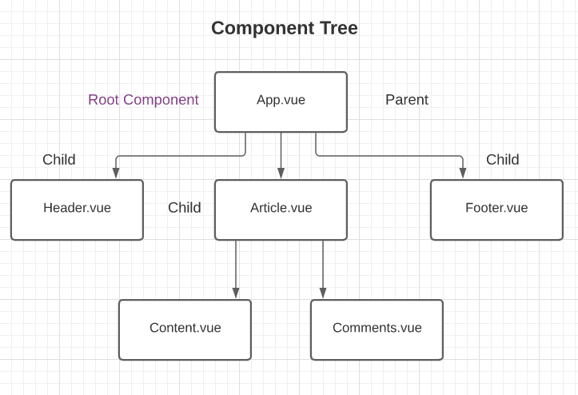

# Vue.js 3

**Vue.js** is a javascript/typescript framework. It's popular for being approachable, versatile and performant and is used for making standalone widgets or web applications.

### Vue 3 New Features

- **The Composition API** - code reusability, organization and readability
- Multiple root elements inside template
- **Teleport component** - render content from one component in a different place in the DOM (modals)
- **Suspense Component**
  - used to handle asynchronus components
  - can provide fall-back content (spinner) until data is loaded
- Provides Typescript support

## Index

- [Add Vue using CDN](#addVueCdn)
- [Create Vue project](#createProject)
- [Component](#component)
- [Lifecycle hooks](#lifecycleHooks)
- [Vue.js devtools](#devtools)
- [Template syntax and Expressions](#syntax)
- [List rendering](#list)
- [Form input bindings](#inputBinding)
- [User events](#userEvents)
- [Methods](#methods)
- [Conditional rendering](#conditional)
- [Attribute binding](#attributeBinding)
- [Dynamic CSS classes](#dynamicCssClass)
- [Computed Properties](#computedProperties)
- [Template refs](#templateRefs)
- [Styling](#styling)
- [Props](#props)
- [Emitting custom events](#customEvents)
- [Event modifiers](#eventModifiers)
- [Key modifiers](#keyModifiers)
- [System modifiers](#systemModifiers)
- [Mouse button modifiers](#mouseBtnModifiers)
- [Slot](#slot)
- [Teleport](#teleport)

<a name="addVueCdn"></a>

## Add Vue using CDN

This script needs to be added in our html file.

```html
<script src="https://unpkg.com/vue@3"></script>
```

- For creating an app and mounting it to a certain part of the app, write the div-id inside the **mount** method to control whatever is inside that div with Vue.

  ```html
  <script>
    const appName = Vue.createApp({
      data() {
        return {
          header: "Vue is ready!",
        };
      },
    }).mount("#div-id");
  </script>
  ```

  The app can also be created in a separate js file and linked with a script inside the <body> tag.

  ```html
  <script src="srcFileName.js"></script>
  ```

- For displaying this data in the page we can use the double mustache syntax. Remember that the variables created in **data** can only be accessed inside the div where we mounted the app.
  ```html
  <div id="div-id">
    <h1>{{header}}</h1>
  </div>
  ```
- To check out Vues **reactivity system**, we can create an input field and use Vues v-diective model that helps in **two-way data binding** meaning if you change the input, the header's gonna change and if you change the header, the input's gonna change. It can also be manipulated from the console.
  ```html
  <input v-model="header" />
  ```

<a name="createProject"></a>

## Create project

- Install nodejs and vue/cli globally.
  ```console
  $ sudo apt update
  $ curl -sL https://deb.nodesource.com/setup_14.x | sudo -E bash -
  $ sudo apt install nodejs
  $ node -v
  $ npm -v
  $ sudo apt install build-essential
  $ sudo npm i @vue/cli -g
  ```
- Create the project in your desired directory.
  ```console
  $ vue create project_name
  ```
- Run the project
  ```console
  $ cd project_directory
  $ npm run serve
  ```

<a name="component"></a>

### Component

Each Vue component can have 3 parts. A component must have a template, the other 2 are optional.

- An html template
- **script** part for exporting the component, importing other componenrs. Here we can define Vue options like **data**, **methods**, **props** etc.
- **style** part for styling the component. By default, these styles are global.

Here's how the component tree of a project with multiple component looks like.


<a name="lifecycleHooks"></a>

### Vue.js lifecycle hooks

[Vue lifecycle diagram](https://v3.vuejs.org/guide/instance.html#lifecycle-diagram)

- **beforeCreate** - this is fired before the creation of the component. We can't access any data or templates here.
- **created** - this is fired after the component has been created. Only templates can be accessed from here.
- **beforeMount** - this is fired after the compilation and just before mounting the app. Here we can access all data, events and templates.
- **mounted** - this is fired after the component is mounted. Most **fetch** requests are created here, but it can be done in created or beforeMount hooks too.
- **beforeUpdate** - this is fired before re-rendering changed data to the DOM.
- **updated** - after updating the data to the DOM, this hook is fired.
- **beforeUnmount** - this is fired before unmounting the component.
- **unmounted** - this is fired after the component unmounts.

<a name="devtools"></a>

### Vue.js devtools

We need to install the **beta version(version 6)** of the **Vue.js devtools** extenion from the chrome web store. The beta version is not available for firefox yet. Then we need to go to manage extensions for this and check **Allow access to file URLs**.

- It injects our Vue intances into the console for us so that we can test and manipulate them without relying on setting them to a variable.
- Helps to keep up with our routes
- Helps to keep up with our Vuex store

<a name="syntax"></a>

### Template syntax and expressions

For separete js file, the html can be written inside the **template** option that Vue provides.

```js
template: "<h2>This is the template</h2>";
```

- js functions can be used inside the double mustache
- Only 1 expression is allowed
- Variables can't be declared and if statements aren't allowed
- Ternary expression is allowed, as well as OR

<a name="list"></a>

### List rendering in Vue 3

- We can make an array in the data and render it using **v-for** loop. A unique key should be used for items. It also supports objects.
  ```js
  listName: [
    { id: 1, label: "item 1" },
    { id: 2, label: "item 2" },
    { id: 3, label: "item 3" },
  ];
  ```
  ```html
  <ul>
    <li v-for="(item, index) in listName" :key="item.id">
      {{index}} {{item.label}}
    </li>
  </ul>
  ```
- To check out these list items from the console, we can write
  ```console
  $vm.data.listName
  ```

<a name="inputBinding"></a>

### Form input bindings

- **v-model** supports modifiers like **lazy, number, trim**.
  - lazy > it syncs the data after change events instead of each input event
  - number > it typecasts the user input a number
  - trim > trims whitespaces from the input
  ```html
  <input type="text" v-model.lazy="newItem" placeholder="Add an item" />
  ```
- It can be used with **text, multiline text, checkbox, radio, select**

<a name="userEvents"></a>

### User Events

**v-on** lets us respond to every event that javascript can. It supports **event modiefiers** and **key modifiers**. The shorthand syntax for v-on is **@**.

- v-on for click events.
  ```html
  <button v-on:click="methodName" class="btn btn-secondary">Add Item</button>
  ```
- v-on with key modifier.
  ```html
  <input
    @keyup.enter="methodName"
    type="text"
    v-model="newItem"
    placeholder="Add an item"
  />
  ```
- Vue provides an event parameter by default to the methods that we use with user events. If we want to pass both the event paramater and another custom parameter in the method, it should be written like this -
  ```html
  <div class="box" @mouseover="handleEvent($event, 5)">mouseover (enter)</div>
  ```

<a name="methods"></a>

### Methods

Vuejs has an option named **mathods** for writing methods. Methods are used for manipulating data while Computed properties are used for transforming them.

```js
methods: {
    methodName(){
       this.items.push({
            id: this.items.length + 1,
            label: this.newItem})
            this.newItem = ""
    }
}
```

<a name="conditional"></a>

### Conditional Rendering

- **v-if**, **v-else**, **v-else-if** and **v-show** is used for conditional rendering of elements.
  ```html
  <button v-if="property_name_for_condition" @click="doEdit(false)">
    Cancel
  </button>
  <button v-else @click="doEdit(true)">Add Item</button>
  <button v-show="property_name_for_condition">Show</button>
  ```
- **v-show** works by toggling an elements **display** css property meaning the element is always present in the DOM. **v-if** removes the element from the DOM if the condition is not satisfied.

<a name="attributeBinding"></a>

### Attribute Binding

**v-bind** is used to bind attributes to elements. The shorthand syntax for this is **:**.

```html
<button v-on:click="saveItem" v-bind:disabled="newItem.length === 0">
  Save Item
</button>
```

<a name="dynamicCssClass"></a>

### Dynamic CSS classes

- There are 2 ways for adding dynamic classes from the main.css file. It's possible to toggle multiple classes with both of these syntaxes.
  - **Object syntax**
    ```html
    <li
      v-for="(item, index) in items"
      :key="item.id"
      :class="{class_name: property_of_the_item}"
    >
      {{item.label}}
    </li>
    ```
  - **Array syntax**
    ```html
    <li
      v-for="(item, index) in items"
      :key="item.id"
      :class="[property_of_the_item ? 'class_name_1' : 'class_name_2']"
    >
      {{item.label}}
    </li>
    ```
- For adding a regular non-dynamic class to an element, we can use the **class** property or pass a string to our bound classes.
  ```html
     <li
      v-for="(item, index) in items" :key="item.id"
      class="static_class"
      :class="[property_of_the_item ? 'class_name_1' : 'class_name_2']>
      {{item.label}}
     </li>
  ```
  ```html
  <li
    v-for="(item, index) in items"
    :key="item.id"
    :class="[property_of_the_item ? 'class_name_1' : 'class_name_2',
              'static_class']"
  >
    {{item.label}}
  </li>
  ```

<a name="computedProperties"></a>

### Computed Properties

- The option for writing computed properties is **computed**.
- They're used only for tranforming data for the presentation layer, that's why it's recommended to use a spread operator so that we don't accidentally manipulate any data here.
- They can re-render themselves.
  ```html
  <p>{{characterCount}}/200</p>
  ```
  ```js
  computed: {
      characterCount(){
          return this.newItem.length
      }
  }
  ```

<a name="templateRefs"></a>

### Template refs

It allows us to store a reference of a DOM element inside a variable for manipulating that element using javascript methods.

```html
<template>
  <input type="text" ref="name" />
  <button @click="handleClick">Click</button>
</template>
```

```js
handleClick(){
    console.log(this.$refs.name)
    this.$refs.name.focus()
}
```

<a name="styling"></a>

### Styling

- For any global styling, make a global.css file in the assets folder and import it into the main.js file.
- For setting custom styles for components -

  - we can use the **scoped** property in style tag like this<style scoped>. The way it works is that some random data attribute is added to the style tags and the html elements that use the styles of that class so it appears different than the global styles.
  - make the class names more specific to that component. For example, for a Modal class the styling for h1 can be like this -

  ```.modal h1{}

  ```

<a name="props"></a>

### props

props are needed to make reusable components and to have a single source of truth in an app. For passing a prop, declare it in the <script> of the component you want to recieve it in. This is used for passing simple data.

```js
prop: ["header"];
```

Declare the prop in the data option of the parent element and bind it to the child element.

```html
<ChildComponent :header="header" />
```

<a name="customEvents"></a>

### Emitting custom events

Custom events are used to fire an event in the child component to change something in the parent component.
Make a method in the child component where the custom event is declared. Custom events can take extra data as parameter. It is recommended that the event names should be written in kebab-case.

```js
methodName() {
    this.$emit("custom-event-name")
    this.$emit("custom-event-name", data)
}
```

In the parent component, bind the custom event with the method you want to call.

```html
<ChildComponent @customEventName="methodName" />
```

<a name="eventModifiers"></a>

### Event modifiers

- **.stop** - the events propagation will stop.
- **.prevent** - prevents the events default behavior.
- **.capture** - an event targeting an inner element is handled here before being handled.
- **.self** - only trigger handler if event.target is the element itself.
- **.once** - trigger the event at most once.
- **.passive** - triggers the events default behavior.

<a name="keyModifiers"></a>

### Key modifiers

Key modifiers can be used with the keyboard events **@keyup**, **@keydown** and **@keypress**. The commonly used key aliases provided by Vue are -

- **.enter**
- **.tab**
- **.delete**
- **.esc**
- **.space**
- **.up**
- **.down**
- **.left**
- **.right**

<a name="systemModifiers"></a>

### System modifiers

These are for mouse or keyboard events.

- **.ctrl**
- **.alt**
- **.shift**
- **.meta**
- **.exact** - allows control of the exact combination of system modifiers needed to trigger an event. For example -
  ```html
  <button v-on:click.ctrl.exact="onCtrlClick">Button</button>
  ```
  This event will only fire when only ctrl is pressed.

<a name="mouseBtnModifiers"></a>

### Mouse button modifiers

- **.left**
- **.right**
- **.middle**

<a name="slot"></a>

### slot

They're useful for passing custom templates into components.

- For general slot, write a template you want to pass inside your component tag where the slot will show. Then add <slot></slot> in the template of that component. You can pass a default value inside your slot in case your slot content doesn't show.
  ```html
  <ComponentName>
    <h1>Slot</h1>
  </ComponentName>
  ```
  ```html
  <template>
    <slot>default content</slot>
  </template>
  ```
- For **named slot**, write your template structure inside a <template> tag inside your Component tag and give your template a name using the **v-slot** directive. Then add <slot></slot> with its name attribute in the template of that Component to specify which slot you want to show there.
  ```html
  <ComponentName>
    <template v-slot:slotName>
      <h1>Named slot</h1>
    </template>
  </ComponentName>
  ```
  ```html
  <template>
    <slot name="slotName"></slot>
  </template>
  ```

<a name="teleport"></a>

### Teleport

This component can be used to render content in a different place of the DOM.
For example, if we want to render a component in a custom div outside of the main div in index.html, we need to first write the div in index.html with a different id or class.

```html
<div id="customDivId"></div>
```

Then change the <div> tag of the div you want to teleport to <teleport> and add the **to** attribute to specify the div id or div class you want to teleport to. if you use the id then use **#** and if you use the class, use **.**.

```html
<teleport to="#customDivId">
  <ComponentName />
</teleport>
```
