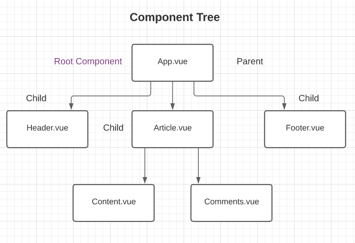

# modal_project

## Create project

- Install nodejs and vue/cli globally.
  ```console
  $ sudo apt update
  $ curl -sL https://deb.nodesource.com/setup_14.x | sudo -E bash -
  $ sudo apt install nodejs
  $ node -v
  $ npm -v
  $ sudo apt install build-essential
  $ sudo npm i @vue/cli -g
  ```
- Create the project in your desired directory.
  ```console
  $ vue create project_name
  ```

## Run the project

If you're cloning this repo, then first -

```console
$ npm install
```

For running the project -

```console
$ npm run serve
```

### Component

Each Vue component can have 3 parts. A component must have a template, the other 2 are optional.

- An html template
- **script** part for exporting the component, importing other componenrs. Here we can define Vue options like **data**, **methods**, **props** etc.
- **style** part for styling the component. By default, these styles are global.

Here's how the component tree of a project with multiple component looks like.


### Template refs

It allows us to store a reference of a DOM element inside a variable for manipulating that element using javascript methods.

```html
<template>
  <input type="text" ref="name" />
  <button @click="handleClick">Click</button>
</template>
```

```js
handleClick(){
    console.log(this.$refs.name)
    this.$refs.name.focus()
}
```

### Styling

- For any global styling, make a global.css file in the assets folder and import it into the main.js file.
- For setting custom styles for components -

  - we can use the **scoped** property in style tag like this<style scoped>. The way it works is that some random data attribute is added to the style tags and the html elements that use the styles of that class so it appears different than the global styles.
  - make the class names more specific to that component. For example, for a Modal class the styling for h1 can be like this -

  ```.modal h1{}

  ```

### props

props are needed to make reusable components and to have a single source of truth in an app. For passing a prop, declare it in the <script> of the component you want to recieve it in. This is used for passing simple data.

```js
prop: ["header"];
```

Declare the prop in the data option of the parent element and bind it to the child element.

```html
<ChildComponent :header="header" />
```

### Emitting custom events

Custom events are used to fire an event in the child component to change something in the parent component.
Make a method in the child component where the custom event is declared.

```js
methodName() {
    this.$emit("custom_event_name")
}
```

In the parent component, bind the custom event with the method you want to call.

```html
<ChildComponent @customEventName="methodName" />
```

### Event modifiers

- **.stop** - the events propagation will stop
- **.prevent** - prevents the events default behavior
- **.capture** - an event targeting an inner element is handled here before being handled
- **.self** - only trigger handler if event.target is the element itself
- **.once** - trigger the event at most once
- **.passive** - triggers the events default behavior

### Key modifiers

The commonly used key aliases provided by Vue for keyboard events are -

- **.enter**
- **.tab**
- **.delete**
- **.esc**
- **.space**
- **.up**
- **.down**
- **.left**
- **.right**

### System modifiers

These are for mouse or keyboard events.

- **.ctrl**
- **.alt**
- **.shift**
- **.meta**
- **.exact** - allows control of the exact combination of system modifiers needed to trigger an event. For example -
  ```html
  <button v-on:click.ctrl.exact="onCtrlClick">Button</button>
  ```
  This event will only fire when only ctrl is pressed.

### Mouse button modifiers

- **.left**
- **.right**
- **.middle**

### slot

They're useful for passing custom templates into components.

- For general slot, write a template you want to pass inside your component tag where the slot will show. Then add <slot></slot> in the template of that component. You can pass a default value inside your slot in case your slot content doesn't show.
  ```html
  <ComponentName>
    <h1>Slot</h1>
  </ComponentName>
  ```
  ```html
  <template>
    <slot>default content</slot>
  </template>
  ```
- For **named slot**, write your template structure inside a <template> tag inside your Component tag and give your template a name using the **v-slot** directive. Then add <slot></slot> with its name attribute in the template of that Component to specify which slot you want to show there.
  ```html
  <ComponentName>
    <template v-slot:slotName>
      <h1>Named slot</h1>
    </template>
  </ComponentName>
  ```
  ```html
  <template>
    <slot name="slotName"></slot>
  </template>
  ```

### Teleport

This component can be used to render content in a different place of the DOM.
For example, if we want to render a component in a custom div outside of the main div in index.html, we need to first write the div in index.html with a different id or class.

```html
<div id="customDivId"></div>
```

Then change the <div> tag of the div you want to teleport to <teleport> and add the **to** attribute to specify the div id or div class you want to teleport to. if you use the id then use **#** and if you use the class, use **.**.

```html
<target to="#customDivId">
  <ComponentName />
</target>
```
